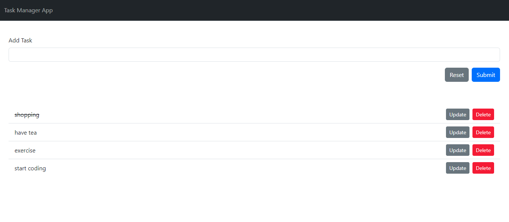
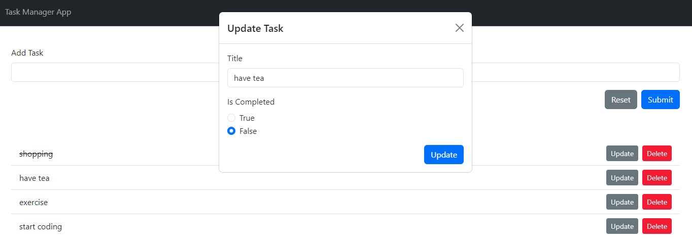

## Task Manager Application

Start the application using:

```sh
npm run dev
```

Start the API using

It will start the API on port 3001. It will use db.json file as model.

```sh
npm run api
```

Task Manager Application using react and redux. Used json-server for serving backend API requests. Things to learn

- react-hooks
- react-redux
- modal dialog
- bootstrap ui library
- toaster

You can use it as boiler plate for your CRUD application. No need to go over lengthy video tutorials.

Screenshots



Update Task


